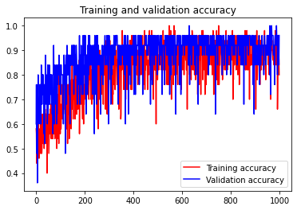

# Anomaly Detection

This model can detect an anomaly from plants using image processing, this model can be used to classify a disease whether it has a disease such as bactery, viral, fungal or in healthy condition.

We're planning to add more type of plant, right now the model that we have, can be able to classify a disease and anomaly in:

## Lettuce Leaf

This model can classify whether the lettuce have a disease, which can be classify into seven groups:

1. Bacterial
2. Fungal
   - Downy Mildew
   - Septoria blight
   - Wilt and Leaf blight
   - Powdery Mildew
3. Viral
4. Healthy

The accuracy for plot is :  

